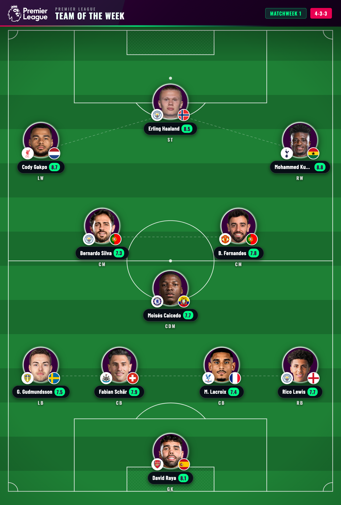
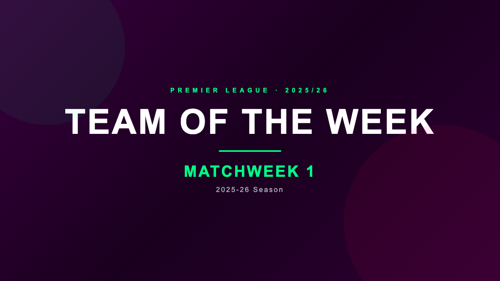
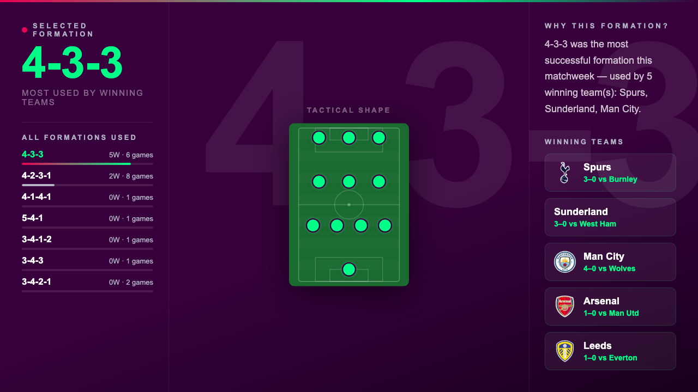
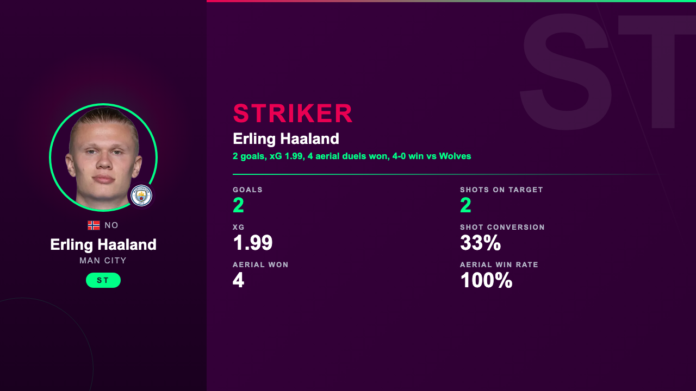

# Premier League Team of the Week Builder

An automated EPL TOTW system powered by Claude Code. Every matchweek it fetches live match data, picks the best XI using AI analyst agents, generates a pitch diagram, builds a PL-styled presentation, and delivers everything by email with Google Drive storage.



---

## Features

### Data Pipeline
- **No API key required** — uses `soccerdata` (FPL + SofaScore) for all 2025-26 season data
- Fetches fixtures, player stats (40+ per player), formation strings, and ratings from SofaScore
- Full response caching — re-runs are instant once data is fetched

### AI-Powered Analysis
- **Parallel research agents** — 3 `researcher-fetcher` agents fetch player/lineup data simultaneously, each covering a third of the 10 fixtures
- **Formation selection** — counts formations used by winning teams; most common winner formation is selected; defaults to 4-3-3
- **Shortlist generation** — `player_evaluator.py` ranks top-3 candidates per position slot using position-specific scoring (xG, xA, aerial_won_rate, dribble_success_rate, accurate_crosses, card penalties)
- **3 parallel analyst agents** — slots split 4/4/3 across three `researcher` agents; each applies expert football judgment (opponent quality, game context, team context) to pick the best player over the algorithmic rank
- **Merge script** — `merge_analyst_selections.py` assembles final `players.json` from analyst outputs, with shortlist rank-1 fallback for any uncovered slot

### Visuals & Presentation
- **Pitch diagram PNG** — Playwright renders a Jinja2 HTML template; player cards with team badges, nationality flags, ratings, and formation connector lines
- **PL-styled presentation** — PDF + PPTX via `python-pptx` + Playwright; includes results slide, formation report (3-column layout with tactical mini-pitch SVG + win-rate bars), 11 player slides with dynamic stats
- **Dynamic stats display** — each player slide shows only impressive/non-zero stats appropriate to the position (e.g. xG for wingers with no goals, tackles for defenders, not assists)

| Title Slide | Formation Analysis | Player Slide |
|:-----------:|:-----------------:|:------------:|
|  |  |  |

### Delivery & Storage
- **Gmail delivery** — Python Gmail API (OAuth2); embeds diagram as base64 inline image, attaches PDF
- **Google Drive upload** — `gdrive_uploader.py` creates season folder structure, uploads 5 files per matchweek
- **GSheet logging** — one tab per matchweek in "TOTW Stats 2025-26" with 24 columns of player stats

### Claude Code Integration
- **Skills** (`/totw`, `/analyze`, `/research`, etc.) — slash commands that orchestrate the full pipeline
- **Custom agents** — `researcher`, `researcher-fetcher`, `visualizer` with specialized system prompts
- **Domain rules** — formation definitions, position evaluation criteria, design system, API guides all loaded as project rules
- **Parallel workflows** — fetcher agents and analyst agents both spawn in a single message for true parallelism

---

## Project Structure

```
scripts/
  soccerdata_client.py         # FPL + SofaScore data fetching and caching
  formation_analyzer.py        # Determines TOTW formation from match data
  player_evaluator.py          # Scores candidates, builds shortlists
  merge_analyst_selections.py  # Merges analyst agent outputs → players.json
  diagram_renderer.py          # Renders pitch diagram PNG via Playwright
  presentation_builder.py      # Builds PDF + PPTX presentation
  email_sender.py              # Renders email HTML
  send_email_gmail.py          # Sends email via Gmail API
  gdrive_uploader.py           # Uploads outputs to Google Drive + GSheet
  report_generator.py          # Writes markdown player/formation reports

templates/
  pitch.html                   # Pitch diagram Jinja2 template
  presentation.html            # Presentation slides Jinja2 template
  email.html                   # Email body Jinja2 template

.claude/
  agents/                      # Custom Claude Code agent definitions
  rules/                       # Domain knowledge (formations, positions, APIs)
  skills/                      # Slash command skill definitions

data/                          # Cached API responses (gitignored)
output/                        # Generated outputs per matchweek (gitignored)
tests/                         # pytest unit tests
```

---

## Requirements

### Minimum (local-only mode)
- Python 3.11+
- Claude Code CLI

### Full pipeline (email + Drive)
- Google Cloud project with Gmail API + Drive API + Sheets API enabled

---

## Setup

> **Just want to try it out?** Steps 1 and 2 are all you need. Use `/totw 30 local` to run the full pipeline locally without any Google account setup.

### 1. Clone and install dependencies

```bash
git clone <repo-url>
cd PL-team-builder
pip install -r requirements.txt
playwright install chromium
```

### 2. Set your email

In `.claude/settings.json`, update the `PROJECT_EMAIL` env var to your Gmail address:

```json
{
  "env": {
    "PROJECT_EMAIL": "you@gmail.com"
  }
}
```

This is the address emails are sent from and to (self-send).

### 3. Google Cloud credentials

You need a single Google Cloud project with three APIs enabled:

1. Go to [console.cloud.google.com](https://console.cloud.google.com)
2. Create a project (or use an existing one)
3. Enable: **Gmail API**, **Google Drive API**, **Google Sheets API**
4. Create an **OAuth 2.0 Desktop App** credential
5. Download the JSON — save as `client_secret.json` in the project root (gitignored)

Then create `.claude/settings.local.json` (gitignored — never commit this file):

```json
{
  "env": {
    "GOOGLE_OAUTH_CLIENT_ID": "your-client-id.apps.googleusercontent.com",
    "GOOGLE_OAUTH_CLIENT_SECRET": "your-client-secret",
    "GDRIVE_CREDS_DIR": "/Users/you/.config/mcp-gdrive"
  }
}
```

### 4. Authenticate Gmail (first run only)

```bash
python3 scripts/send_email_gmail.py 1
```

A browser window opens for OAuth consent. After approving, a token is saved to `~/.config/pl-totw/gmail_token.json` and reused on all future runs.

### 5. Set up the GDrive MCP server

The `@isaacphi/mcp-gdrive` MCP server handles Drive search/read (uploads use the Python script).

```bash
npx @isaacphi/mcp-gdrive
```

On first tool use inside Claude Code, a browser opens for OAuth consent. Token is saved to your `GDRIVE_CREDS_DIR`.

### 6. Set up the Gmail MCP server

```bash
npx @gongrzhe/server-gmail-autoauth-mcp
```

Token saved to `~/.gmail-mcp/`.

### 7. Claude Code settings

`.claude/settings.json` already contains MCP server definitions and permissions. You only need to:
- Update `PROJECT_EMAIL` to your Gmail address
- Create `.claude/settings.local.json` with your OAuth credentials (step 3)

---

## Usage

All commands run inside **Claude Code** chat.

### Local-only mode (no Google account needed)

Add `local` to any `/totw` or `/research` command to skip email delivery, GDrive upload, and GDrive cache checks. All outputs are saved to `output/matchweek-{N}/`.

```
/totw 30 local  # Build TOTW for Matchweek 30, save locally only
/totw local     # Latest completed matchweek, local only
```

### Full pipeline (email + Drive)

```
/totw 30        # Build TOTW for Matchweek 30
/totw           # Build TOTW for the latest completed matchweek
```

Runs all stages: fetch → analyze → diagram → presentation → email → Drive upload.

### Individual stages

```
/research 30 local  # Fetch match data only (skip GDrive cache check)
/research 30        # Fetch match data (checks GDrive cache first)
/analyze 30         # Formation + player selection (requires /research)
/visualize 30       # Generate pitch diagram PNG (requires /analyze)
/presentation 30    # Build PDF + PPTX (requires /visualize)
/email 30           # Send email (requires /presentation)
/gdrive 30          # Upload to Drive + log to GSheet (requires /presentation)
```

### Python scripts directly (terminal)

```bash
python3 scripts/soccerdata_client.py check-status 30   # Check if matchweek is complete
python3 scripts/soccerdata_client.py fetch-round 30    # Fetch fixtures
python3 scripts/soccerdata_client.py fetch-players 30  # Fetch player stats
python3 scripts/formation_analyzer.py 30               # Select formation
python3 scripts/player_evaluator.py 30                 # Build shortlists
python3 scripts/merge_analyst_selections.py 30         # Merge analyst picks
python3 scripts/diagram_renderer.py 30                 # Render pitch diagram
python3 scripts/presentation_builder.py 30             # Build presentation
python3 scripts/email_sender.py 30                     # Render email HTML
python3 scripts/send_email_gmail.py 30                 # Send email
python3 scripts/gdrive_uploader.py 30                  # Upload to Drive
```

### Tests

```bash
pytest tests/ -v
```

---

## How the Analysis Works

1. **Formation** — counts how many winning teams used each formation; most popular wins; ties broken by goals scored; defaults to 4-3-3
2. **Shortlists** — `player_evaluator.py` scores every eligible player per position slot using xG, xA, aerial win rate, dribble success rate, accurate crosses, total passes, and card penalties; saves top-3 per slot to `shortlists.json`
3. **Analyst agents** — 3 parallel Claude `researcher` agents each cover ~4 positions; they read shortlist stats, dig into raw player JSON for context, and apply football judgment to pick the top 1 per slot (opponent quality, game context, winning team preference)
4. **Merge** — `merge_analyst_selections.py` combines the 3 analyst files and looks up each selected player by ID from the raw SofaScore cache

---

## Google Drive Structure

```
My Drive/
  EPL TOTW Reporter/
    2025-26/
      TOTW Stats 2025-26      ← GSheet, one tab per matchweek (24 stat columns)
      matchweek-01/
        totw_diagram.png
        presentation.pdf
        presentation.pptx
        players.json
        formation.json
      matchweek-02/
        ...
```

---

## Environment Variables Reference

| Variable | File | Description |
|---|---|---|
| `PROJECT_EMAIL` | `.claude/settings.json` | Gmail address for sending/receiving TOTW emails |
| `GOOGLE_OAUTH_CLIENT_ID` | `settings.local.json` | OAuth client ID from Google Cloud Console |
| `GOOGLE_OAUTH_CLIENT_SECRET` | `settings.local.json` | OAuth client secret |
| `GDRIVE_CREDS_DIR` | `settings.local.json` | Path where GDrive MCP stores its OAuth token |
| `API_FOOTBALL_BASE_URL` | `.claude/settings.json` | API-Football base URL (pre-set, legacy historical data only) |

`settings.local.json` is gitignored. Never commit it.

---

## Tech Stack

| Component | Technology |
|---|---|
| Data fetching | `soccerdata` (FPL API + SofaScore API) |
| AI orchestration | Claude Code + Claude Agent SDK |
| HTML rendering | Playwright (headless Chromium) |
| Templates | Jinja2 |
| Presentation | `python-pptx` + Playwright PDF export |
| Data models | Pydantic |
| Email | Gmail API (OAuth2) |
| Storage | Google Drive API v3 + Sheets API v4 |
| MCP servers | `@gongrzhe/server-gmail-autoauth-mcp`, `@isaacphi/mcp-gdrive` |
